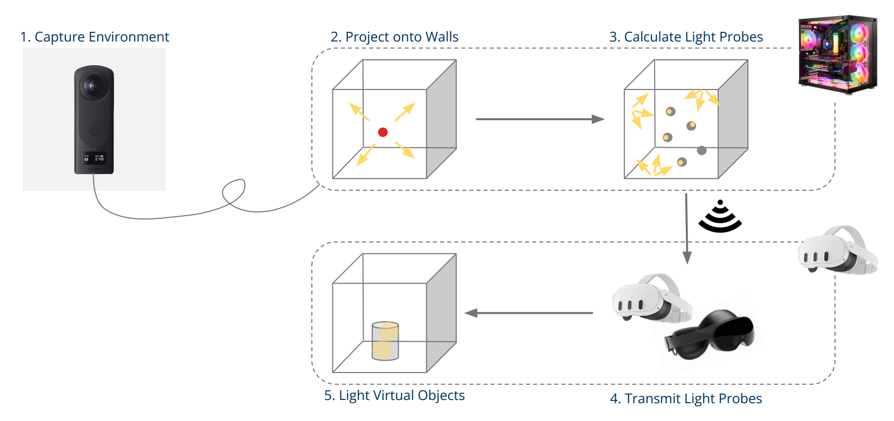
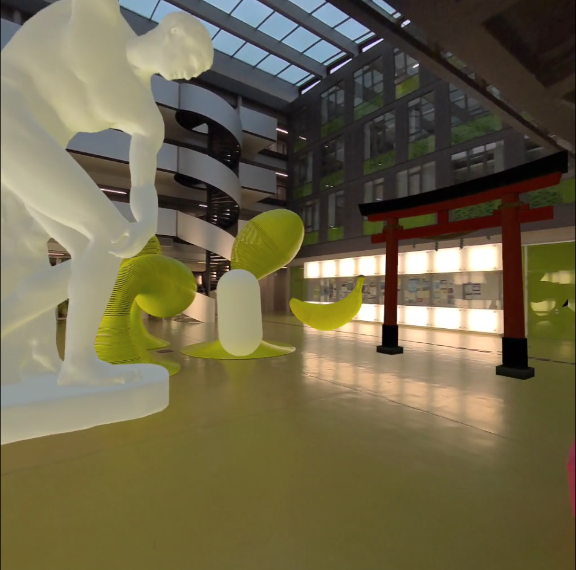
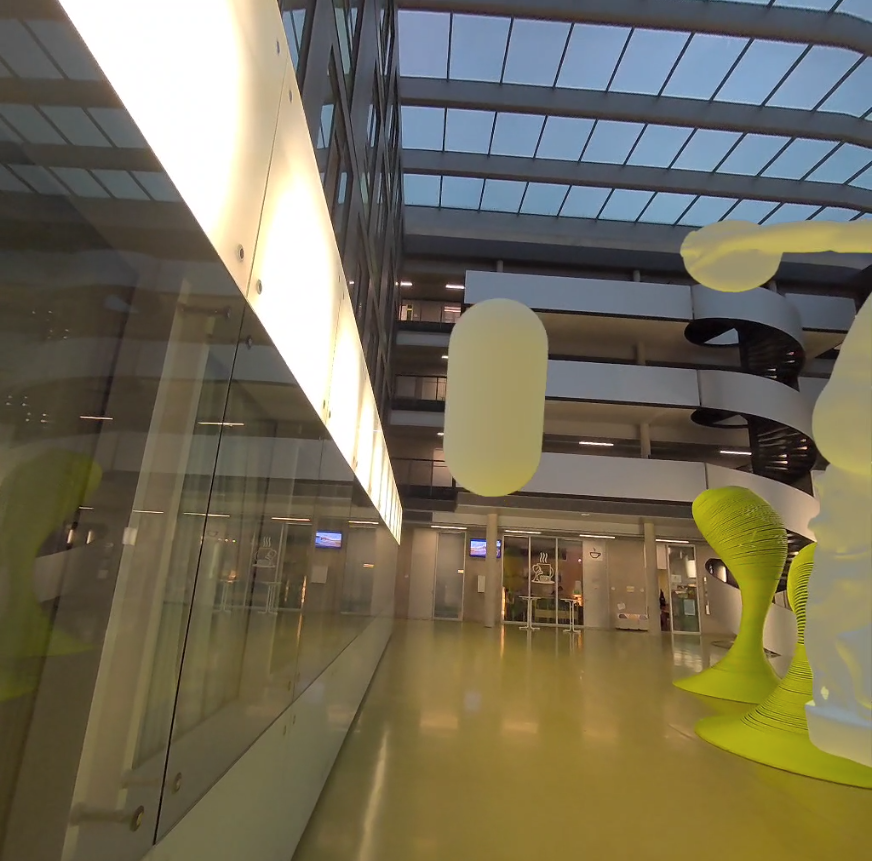
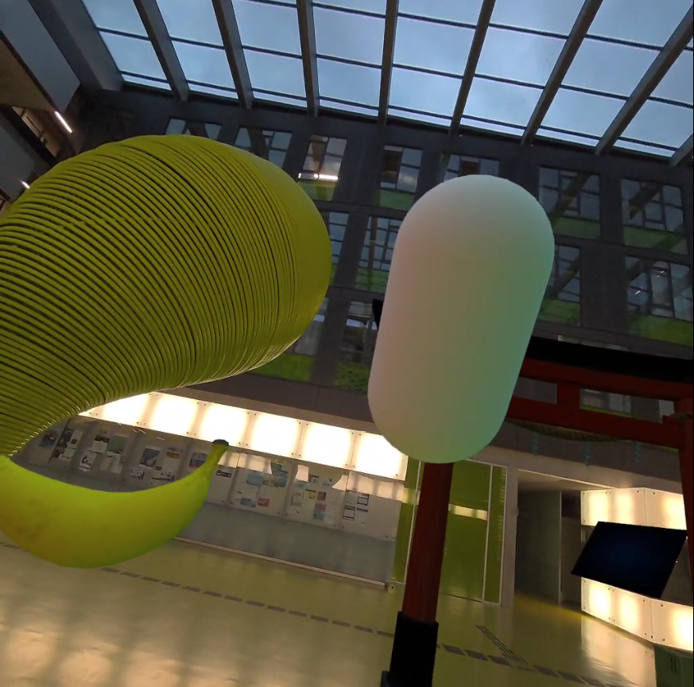
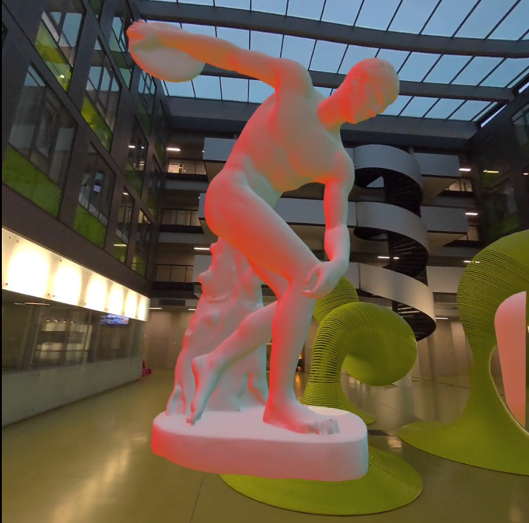
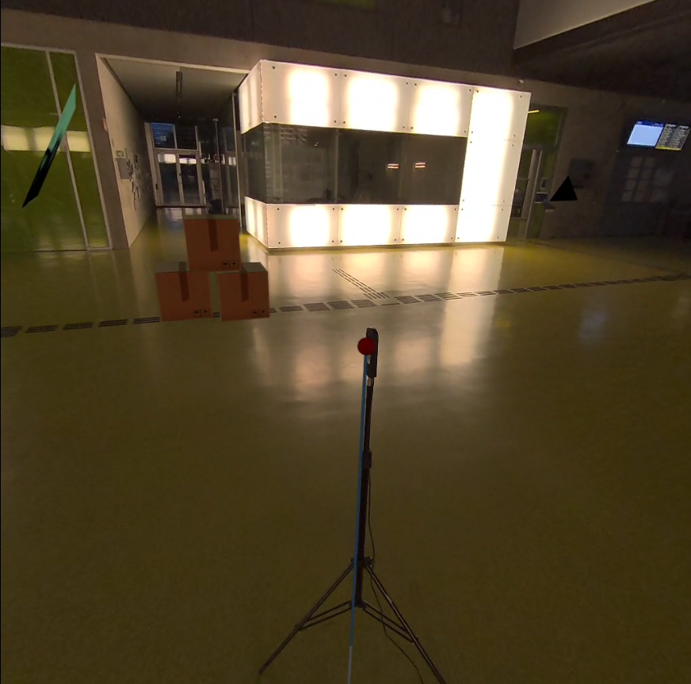

# Real-time Lighting for Mixed Reality Applications

This project was created as a student research project at the TU Dresden (INF-PM-FPA).

Please have a look at the subfolders.

## Description

This project is a mixed reality demo that can update the lighting in real-time using a 360 degree camera and a computer (next to the mobile HMD) to project the image onto a model and stream the light probes to the mobile device.

The research Question:

> How can we get lighting information from the physical world
to the MR application in real-time?

- Use 360° camera instead of fish eye lens
- Use model of the room to project image onto
- Use emissive material to cast light into the scene
- Use light probes to light virtual objects

## Architecture

## Results

Note: The red light comes from a virtual texture where the wall or the sculpture is painted red.