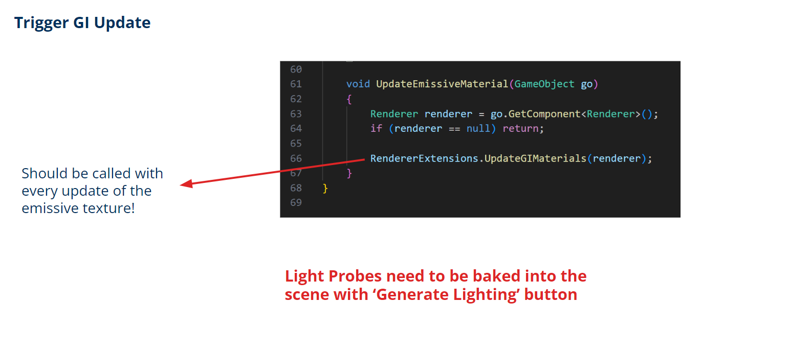

# Emissive material based lighting + realtime light probe streaming to multiple AR devices
## Repo Overview
- [RT_Light_Probes_PC](https://dev.ixlab.inf.tu-dresden.de/student-projects/researchprojects/niko-kirste/rt_light_probes_pc "Student-Projects / ResearchProjects / Niko-Kirste / RT_Light_Probes_PC"): Unity PC client that handles camera projection to a room model & sending of light probes over the network (uses HDRP → old version)
- [RT_Light_Probes_Quest](https://dev.ixlab.inf.tu-dresden.de/student-projects/researchprojects/niko-kirste/rt_light_probes_quest): Unity Quest client that receices light probes from the PC client & demonstrates lighting with some sculptures (does not use ViewR → old version)
- **[RT_Light_Probes_PC_URP](https://dev.ixlab.inf.tu-dresden.de/student-projects/researchprojects/niko-kirste/rt_light_probes_pc_urp "Student-Projects / ResearchProjects / Niko-Kirste / RT_Light_Probes_PC_URP"): Unity PC client that handles camera projection to a room model & sending of light probes over the network (uses URP)**
- **[RT_Light_Probes_Quest_ViewR](https://dev.ixlab.inf.tu-dresden.de/student-projects/researchprojects/niko-kirste/rt_light_probes_quest_viewr): Unity Quest client that receices light probes from the PC client & demonstrates lighting with some sculptures (uses ViewR)**

## RT_Light_Probes_PC_URP
current branch: **main**
### Hierarchy
- APB: contains all important objects
	- ProjectionCenter: is at the position of the 360° camera
		- Script **Projection UV**: Handles the UV mapping of the 360° image to the room model. Every object that should be affected by the mapping should be added to the *Objects* list. The *Map Uv Button* checkbox triggers a remapping (e.g. after the position changed). The additional parameters are for image offset and for rotation of the camera.
	- FoyerAPB: old model of the foyer (unused)
	- APB_Cube: approximation of the foyer using 6 planes
	- APB_Cube_with_blobs: 6 planes and the green blobs for testing (unused)
	- FoyerAPB_Holes: new model of the foyer (holes are covered)
	- Models: container for some sculpures for testing (unused)
	- VideoPlayer: is used to render different media to a RenderTexture
		- Component **VideoPlayer**: can be used to play a video file to the RenderTexture (currently unused)
		- Script **Webcam to Render Texture**: renders webcam stream or a static image to the RenderTexture and handles updating the materials of the emissive objects. Every object that uses emissive material and that should be updated with every frame should be placed in the *Emissive Objects* list. *Camera Device Name* is used for partial webcam name matching. *Enable Webcam* controls whether the webcam stream should be rendered to the texture. *Image* is the static image that should be rendered. *Enable Image* controls whether the static image should be rendered to the texture.
	- Light Probe Group (targeted): a set of a few light probes placed around the target objects
		- Script **Light Probe Data Sender**: sends the light probe coefficients over UDP. *IP Address* is the destination IP. Broadcast addresses also work (**CHECK FIREWALL RULES!!!**). *Only Sync Changes* only transmits probes with relevant value changes (reduces network usage). *Sync Threshold* controls the amount of change of a single probes coefficients needed to be transmitted when Only Sync Changes is activated. *Coefficient divider* can be used to scale the values (e.g. when using different render pipelines)
		- Script **Light Probe Position Sender**: transmits the light probe array to another computer (**receiving must first be enabled on the other side**)
		- Script **Light Probe Position Receiver**: receives light probes from other senders if receiving is enabled.
	- Light Probe Group (everywhere): a set of light probes spread all around the foyer
		- ... see above

### Additional Things
- Light Probe Groups are baked into the Lighting Data Asset. Multiple Assets for the different scenarios exists but must be selected! When the light probe positions are changed the lighting needs to be regenerated! (**I also experienced a bug(?) where changing the Lighting Data Asset had no impact on the baked light probes**)
- ~~We found out that the lighting has an unnatural blue tint which probably comes from the blue sky and from the blueish walls. Therefore the environment texture can be multiplied by a "luminance" texture where we can reduce the impact of the sky. You can assign different textures on the **MultiplyMaterial (Assets → Materials)**. All relevant textures are in the **Textures** folder.~~
- **The blue tint actually comes from the color space setting in the Oculus plugin in Unity. If you experience wrong colors try to play around with this setting. Setting it to 'unmanaged' worked best for us.**

## RT_Light_Probes_Quest_ViewR
current branch: **main**

### Scenes
- ViewR-Start_FoyerAPB: the entry point for ViewR which also handles calibration
- APB_Light_Probe_Streaming: the main scene with the APB model and the interactable sculpures

### Hierarchy
- FoyerAPB: the model of the APB which can be blended in and out by ViewR
- Models: Contains all models that receive lighting. The models can be grabbed and moved through the foyer. The models are not affected by the blending.
- Light Probe Group (targeted): a set of light probes that are placed around the sculptures.
	- Script **Light Probe Data Receiver**: receives the light probe coefficients from the other computer. Can be enabled or disabled with the *Can Receive Button*. (**CHECK FIREWALL RULES!!!**)
	- Script **Light Probe Position Receiver**: receives light probes from other senders if receiving is enabled.
	- Script **Light Probe Position Sender**: transmits the light probe array to another computer (**receiving must first be enabled on the other side**)
- Light Probe Group (everywhere): a set of light probes spread all around the foyer
	- ... see above
- CameraPosition: a marker at the physical position of the camera that helps with camera placement (**should have the same coordinates as the ProjectionCenter in the other project**)

### Additional Things
- For some reason (bug?) the light probes keep disappearing from time to time. **When you click on a light probe group and it is activated you should see the light probes in the editor. If not you need to**
	- roll back with git,
	- sync the light probes from the other project or
	- or edit the scene file by hand (**m_SourcePositions**)
- Sometimes the selected Lighting Asset resets when switching the scene...
- **Precompiled APKs exist in the apks folder**

## Important Lighting Settings

### Server Side:

### Client Side:

### Please also have a look at the presentation in the corresponding folder for more information.